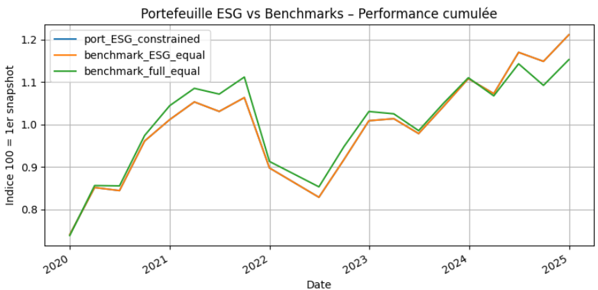

# README – Notebook **`main.ipynb`**

Ce notebook unique réunit les trois premières parties techniques du projet :
1. **Création de la base de données**  
2. **Jointure et construction de l’univers ESG (best‑in‑class 30 %)**  
3. **Stratégie d’investissement + Back‑test UCITS 5/10/40**  

La partie 4 “Analyse extra‑financière” est livrée séparément en PDF.

---

  

## Adéquation au cahier des charges

| Exigence | Réalisé dans ce notebook |
|----------|-------------------------|
| **Base MSCI EMU ≥ 3 ans, prix + notes ESG** | ✅ Étapes 1 & 2 chargent tous les snapshots 2019‑2025 et ajoutent les scores Sustainalytics/MSCI. |
| **Filtre best‑in‑class 30 % trimestriel** | ✅ Étape 2 calcule le percentile par secteur et crée le flag `in_esg_universe`. |
| **Stratégie dans l’univers ESG** | ✅ Étape 3 sélectionne uniquement les titres `in_esg_universe == True`. |
| **Contraintes UCITS 5/10/40** | ✅ Fonction `apply_5_10_40()` rabote les poids avant chaque rebalancing. |
| **Back‑test et comparaison** | ✅ Portefeuille ESG contraint vs benchmark ESG égal‑pondéré vs univers initial égal‑pondéré ; courbes cumulées + CSV. |
| **Code très commenté** | ✅ Chaque bloc est précédé d’une cellule Markdown explicative. |

---

## Déroulé détaillé des étapes

| Étape | Cellules | Fonction |
|-------|----------|----------|
| **Étape 1 – Création du dataframe** | 2‑9 | • Liste tous les fichiers `MXEM as of … .xlsx` • Lit chaque fichier, ajoute `SnapshotDate`, concatène. • Normalise colonnes, crée `ticker_bb`, sauvegarde `constituents_snapshot.csv`. |
| **Étape 2 – Jointure ESG & univers 30 %** | 11‑19 | • Charge `constituents_snapshot.csv` + `Score ESG brut.csv`. • Nettoie tickers, mappe suffixes, dé‑duplique ESG. • Merge → `universe_esg` ; calcule percentile sectoriel, flag `in_esg_universe`; sauvegarde `universe_with_esg.csv`. |
| **Étape 3 – Stratégie & Back‑test** | 21‑27 | • Charge les tables, pivote les prix, calcule rendements T+1. • Applique poids égal + fonction `apply_5_10_40()` tous les trimestres. • Calcule rendements portefeuille vs deux benchmarks. • Crée courbes cumulées, trace graphique, export `backtest_cumperf.csv`. |

> Après exécution complète, le notebook fournit :  
> * un fichier `constituents_snapshot.csv` (base de données)  
> * `universe_with_esg.csv` (univers + scores)  
> * `backtest_cumperf.csv` + graphique (résultat de la stratégie)  

Ces artefacts satisfont les parties 1 à 3 du projet ; l’analyse ESG détaillée d’une valeur (partie 4) est développée dans le document PDF séparé.
